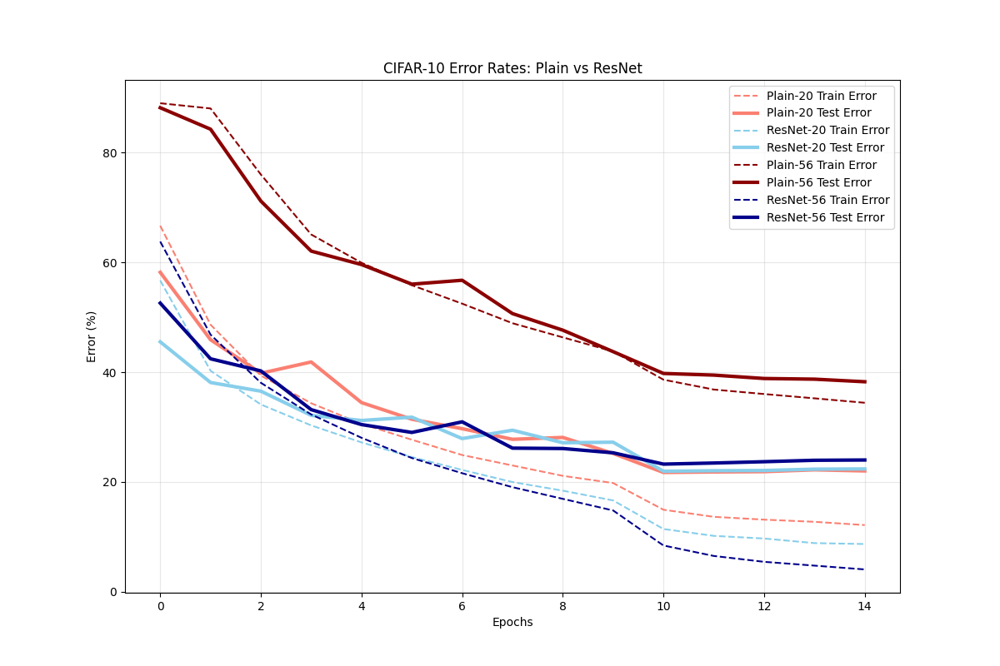

# Deep Residual Learning: Reproducing the Degradation Problem

This project is a PyTorch implementation of the core concepts introduced in the landmark paper ["Deep Residual Learning for Image Recognition" (He et al., 2015)](https://arxiv.org/abs/1512.03385).

The goal of this repository is to empirically reproduce and verify the "degradation problem"—the counterintuitive phenomenon where adding more layers to a deep neural network actually *increases* training error—and demonstrate how Residual Networks (ResNets) solve it.

I implemented both **Plain Networks** and **Residual Networks** of varying depths (20 layers vs. 56 layers) and trained them on the CIFAR-10 dataset to test two core hypotheses from the paper:

1. **The Degradation Problem:** Deeper plain networks (56 layers) should perform *worse* than shallow ones (20 layers) due to optimization difficulties, not overfitting.
2. **The Residual Solution:** Introducing shortcut connections (ResNets) should resolve this optimization hurdle, allowing the 56-layer model to train successfully and achieve lower error rates.

---

## Results & Analysis

After training the models, the validation and training error rates were plotted across 15 epochs. The results successfully validate both hypotheses.

### Key Observations:
* **Hypothesis 1 Confirmed (The Degradation Problem):** Notice the massive gap between the red lines. The 56-layer Plain network (dark red) has significantly higher training and test errors (~40%) compared to the shallower 20-layer Plain network (light red, ~22%). The deeper network is failing to optimize.
* **Hypothesis 2 Confirmed (The Residual Solution):** By simply adding skip connections, the 56-layer ResNet (dark blue) completely overcomes the degradation problem. Its training error (dashed dark blue line) plummets to the lowest on the chart (approaching ~4%), proving that residual blocks allow ultra-deep networks to be optimized effectively.

*(Note: While ResNet-56 achieves the lowest training error, training for a standard 100+ epochs with learning rate decay would likely widen the gap in test accuracy between the 20-layer and 56-layer ResNets.)*

---

## References
K. He, X. Zhang, S. Ren, and J. Sun, "Deep Residual Learning for Image Recognition," CVPR, 2015.
